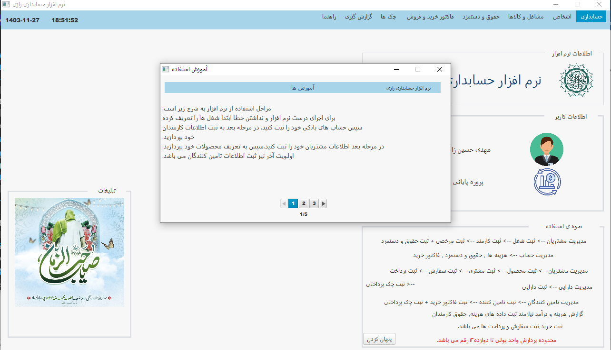
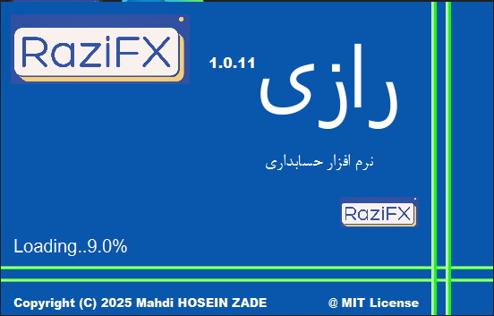
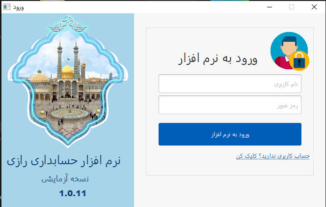
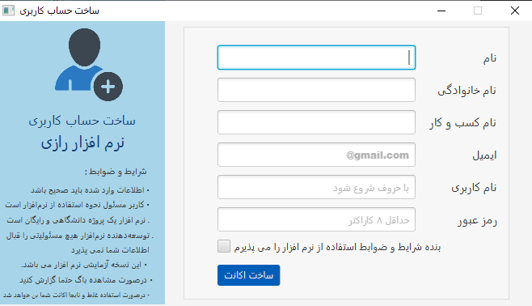

# RaziFX - Simple Income and Expense Management

RaziFX is a JavaFX desktop application designed to help users manage their income and expenses efficiently. It provides a user-friendly interface for tracking financial transactions, generating reports, and gaining insights into your financial health.


<p>v1.0.12</p>

<br>
<hr>

## Features

* **Income and Expense Tracking:** Easily record and categorize your income and expenses.
* **Transaction History:** View and filter your transaction history.
* **Reporting:** Generate reports using JasperReports to visualize your financial data.
* **Data Persistence:** Utilizes Hibernate for robust data management and MySQL for database storage.
* **User-friendly Interface:** Developed with JavaFX and RaziFX for a modern and intuitive user experience.

<br>
<hr>

## Technologies Used

* **JavaFX:** For building the graphical user interface.
* **RaziFX:** A JavaFX library that enhances development productivity.
* **Zulu JDK 8:** The Java Development Kit used for compiling and running the application.
* **JavaFX SDK:** Provides the necessary JavaFX libraries.
* **Hibernate:** An Object/Relational Mapping (ORM) framework for data persistence.
* **MySQL:** A relational database management system for storing application data.
* **JasperReports:** A reporting library for generating dynamic reports.

<br>
<hr>

## Prerequisites

Before running RaziFX, ensure you have the following installed:

* **[ZuluFX v8.82.0.2](https://www.azul.com/downloads/?package=jdk#zulu):** Download and install Zulu JDK 8 from [Azul Systems](https://www.azul.com/downloads/?version=java-8-lts&package=jdk). Make sure to configure your `JAVA_HOME` environment variable.
* **JavaFX SDK:** The ZuluFX v8.82.0.2 mentioned above includes this lib and you do not need to install and prepare it separately..
* **MySQL Server:** Install and configure MySQL Server. Create a database for RaziFX.
* **MySQL Connector/J:** Download the MySQL Connector/J JAR file and add it to your project's classpath.
* **JasperReports 6.0.0:** Download and add all the necessary JasperReports JAR files to your project's classpath.
* **[Hibernate v5](https://hibernate.org/orm/releases/):** Download and add all the necessary Hibernate JAR files to your project's classpath.

<br>
<hr>

## Setup and Installation

1.  **Clone the Repository:**
    ```bash
    git clone [https://github.com/aucnom/RaziFX]
    cd RaziFX
    ```
2.  **Configure Database:**
    * Create a MySQL database for RaziFX.
    * Update the Hibernate configuration file (`hibernate.cfg.xml` or similar) with your database connection details (URL, username, password).
3.  **Add Libraries:** Add all the required jar files to your project.
4.  **Build the Project:**
    * Use your preferred IDE (e.g., IntelliJ IDEA, Eclipse) or build tool (e.g., Maven, Gradle) to build the project.
5.  **Run the Application:**
    * Execute the main class of the application.

<br>
<hr>

## Usage

1.  **Add Income/Expense:** Use the provided forms to add new income or expense transactions.
2.  **View Transactions:** Browse and filter your transaction history.
3.  **Generate Reports:** Generate reports using the reporting functionality to visualize your financial data.
4.  **Cross Platform:** You can run it on any system architecture and operation system.

<br>
<hr>

## Screenshots

<h4>Preloader</h4>



<h4>Login</h4>



<h4>Create User</h4>



<h4>Rest of screenshots</h4>

* `attachments/screenshots`: You can see the rest of the screenshots in this direction.

<br>
<hr>

## Contributing

Contributions are welcome! If you find any issues or have suggestions for improvements, please feel free to submit a pull request or open an issue.

<br>
<hr>

## License

RaziFX is licensed under the MIT License

<br>
<hr>

## Copyright

Copyright &copy; 2025 RaziFX @aucnom
